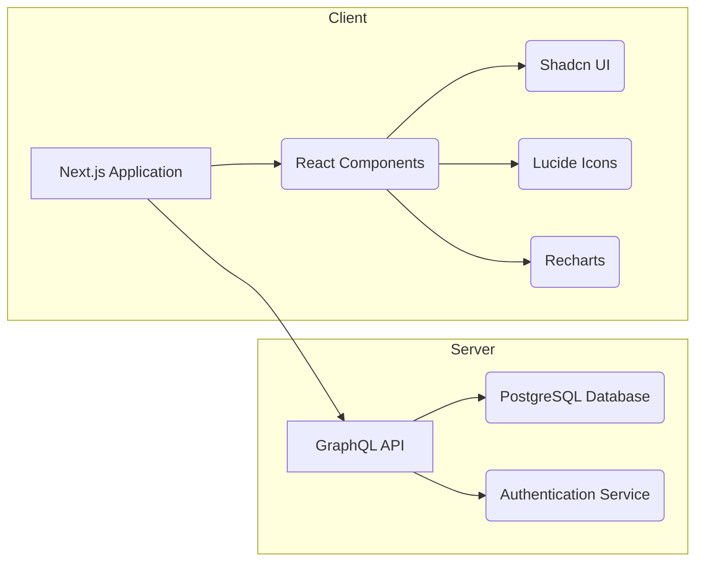

# Documentation Technique : Application Next.js avec GraphQL et Shadcn UI

👋 Bienvenue dans la documentation de notre application Next.js. Ce document détaille l'architecture, la configuration, l'utilisation et la maintenance de l'application.

## Table des Matières

1. [Vue d'ensemble du projet](#1-vue-densemble-du-projet)
2. [Architecture technique](#2-architecture-technique)
3. [Instructions de configuration](#3-instructions-de-configuration)
    * [Prérequis](#31-prerequis)
    * [Installation des dépendances](#32-installation-des-dependances)
    * [Lancement de l'application](#33-lancement-de-lapplication)
4. [Dépendances et prérequis](#4-dependances-et-prerequis)
5. [Configuration](#5-configuration)
    * [Configuration Next.js (`next.config.ts`)](#51-configuration-nextjs-nextconfigts)
    * [Configuration Tailwind CSS (`tailwind.config.ts`)](#52-configuration-tailwind-css-tailwindconfigts)
    * [Configuration ESLint (`eslint.config.mjs`)](#53-configuration-eslint-eslintconfigmjs)
    * [Configuration PostCSS (`postcss.config.mjs`)](#54-configuration-postcss-postcssconfigmjs)
    * [Configuration TypeScript (`tsconfig.json`)](#55-configuration-typescript-tsconfigjson)
    * [Configuration Shadcn UI (`components.json`)](#56-configuration-shadcn-ui-componentsjson)
6. [Documentation de l'API (GraphQL)](#6-documentation-de-lapi-graphql)
7. [Cas d'utilisation courants](#7-cas-dutilisation-courants)
8. [Guide de dépannage](#8-guide-de-depannage)
9. [Considérations de sécurité](#9-considerations-de-securite)
10. [Optimisations de performance](#10-optimisations-de-performance)
11. [Lignes directrices pour les tests](#11-lignes-directrices-pour-les-tests)
12. [Processus de déploiement](#12-processus-de-deploiement)
13. [Procédures de maintenance](#13-procedures-de-maintenance)
14. [Informations de contact et contributions](#14-informations-de-contact-et-contributions)


## 1. Vue d'ensemble du projet

Ce projet est une application web développée avec Next.js, utilisant GraphQL comme couche d'API et Shadcn UI pour l'interface utilisateur.  L'application fournit un tableau de bord personnalisé pour les utilisateurs, affichant des informations sur leur progression, leurs projets, et leurs audits.  Elle est conçue pour être scalable, performante et sécurisée.


## 2. Architecture technique

L'application suit une architecture client-serveur, avec une API GraphQL côté serveur et une interface utilisateur Next.js côté client.



**Modèle de conception:** L'application utilise le pattern **Model-View-Controller (MVC)** pour séparer les préoccupations.  Next.js gère le routing et le rendu, les composants React constituent la vue, et les services et le code d'API gèrent le modèle et le contrôleur.  L'utilisation de Context API en React permet une gestion efficace de l'état global.

**Décisions architecturales:**

* **Next.js:** Choisi pour ses performances de rendu, son routage et sa facilité d'intégration avec React.
* **GraphQL:**  Utilise pour une gestion efficace des données et une meilleure performance des requêtes.
* **Shadcn UI:**  Intégration d'une librairie UI pour accélérer le développement et maintenir une cohérence visuelle.
* **Tailwind CSS:** Utilise pour un style rapide et efficace.
* **TypeScript:**  Implémenté pour la sécurité de typage et l'amélioration de la maintenabilité du code.


## 3. Instructions de configuration

### 3.1 Prérequis

* Node.js et npm (ou yarn, pnpm, bun) installés.
* Un éditeur de code (VS Code recommandé).
* Git installé (pour le clonage du dépôt).

### 3.2 Installation des dépendances

Après avoir cloné le dépôt, naviguez vers le répertoire du projet et exécutez la commande suivante :

```bash
npm install
```

ou

```bash
yarn install
```

ou

```bash
pnpm install
```

ou

```bash
bun install
```


### 3.3 Lancement de l'application

Pour lancer l'application en mode développement, exécutez :

```bash
npm run dev
# or yarn dev
# or pnpm dev
# or bun dev
```

L'application sera accessible à l'adresse `http://localhost:3000`.


## 4. Dépendances et prérequis

| Nom            | Version    | Description                                      |
|-----------------|-------------|--------------------------------------------------|
| Next.js         | (voir `package.json`) | Framework React                                 |
| React            | (voir `package.json`) | Bibliothèque JavaScript                            |
| GraphQL         | (voir `package.json`) | Langage de requête                               |
| Shadcn UI       | (voir `package.json`) | Bibliothèque d'interface utilisateur              |
| Tailwind CSS     | (voir `package.json`) | Framework CSS                                     |
| TypeScript       | (voir `package.json`) | Surcouche de JavaScript                           |
| Recharts         | (voir `package.json`) | Bibliothèque de graphique                         |
| ...             | ...         | Autres dépendances (voir `package.json`)          |


## 5. Configuration

### 5.1 Configuration Next.js (`next.config.ts`)

Ce fichier permet de configurer Next.js.  Actuellement, il est vide, utilisant les paramètres par défaut.  Vous pouvez ajouter des options ici pour personnaliser le comportement de Next.js, par exemple pour l'optimisation des images.

```typescript
// next.config.ts
/** @type {import('next').NextConfig} */
const nextConfig = {
  /* config options here */
}

module.exports = nextConfig
```

[Documentation Next.js Configuration](https://nextjs.org/docs/api-reference/next.config.js/introduction)


### 5.2 Configuration Tailwind CSS (`tailwind.config.ts`)

Ce fichier configure Tailwind CSS. Il spécifie les fichiers sources pour le style, active le mode sombre et étend le thème par défaut.

```typescript
// tailwind.config.ts
/** @type {import('tailwindcss').Config} */
module.exports = {
  content: [
    './src/pages/**/*.{js,ts,jsx,tsx,mdx}',
    './src/components/**/*.{js,ts,jsx,tsx,mdx}',
    './src/**/*.{js,ts,jsx,tsx,mdx}',
  ],
  darkMode: 'class',
  theme: {
    extend: {
      colors: {
        'primary': '#3498db', //Exemple
        'secondary': '#2ecc71' //Exemple
      },
      fontFamily: {
        'sans': ['IBM Plex Sans', 'sans-serif'],
      },
    },
  },
  plugins: [require('tailwindcss-animate')],
}

```

[Documentation Tailwind CSS](https://tailwindcss.com/docs/configuration)


### 5.3 Configuration ESLint (`eslint.config.mjs`)

Ce fichier configure ESLint pour vérifier le code et appliquer les meilleures pratiques.

```javascript
// eslint.config.mjs
import { FlatCompat } from '@eslint/eslintrc';

const config = new FlatCompat({
  extends: ['next/core-web-vitals', 'next/typescript'],
}).config;

export default config;
```


### 5.4 Configuration PostCSS (`postcss.config.mjs`)

Ce fichier configure PostCSS, utilisé avec Tailwind CSS.

```javascript
// postcss.config.mjs
/** @type {import('postcss').Config} */
export default {
  plugins: [tailwindcss(), autoprefixer()],
}
```


### 5.5 Configuration TypeScript (`tsconfig.json`)

Ce fichier configure le compilateur TypeScript.

```json
// tsconfig.json
{
  "compilerOptions": {
    "target": "es5",
    "lib": ["dom", "dom.iterable", "esnext"],
    "allowJs": true,
    "skipLibCheck": true,
    "esModuleInterop": true,
    "allowSyntheticDefaultImports": true,
    "strict": true,
    "forceConsistentCasingInFileNames": true,
    "noFallthroughCasesInSwitch": true,
    "module": "esnext",
    "moduleResolution": "node",
    "resolveJsonModule": true,
    "isolatedModules": true,
    "noEmit": true,
    "jsx": "preserve",
    "incremental": true,
    "plugins": [
      {
        "name": "next"
      }
    ],
    "baseUrl": ".",
    "paths": {
      "@/*": ["./src/*"]
    }
  },
  "include": ["next-env.d.ts", "**/*.ts", "**/*.tsx"],
  "exclude": ["node_modules"]
}
```


### 5.6 Configuration Shadcn UI (`components.json`)

Ce fichier configure Shadcn UI.

```json
{
  "ui": {
    "style": "new-york",
    "rsc": true,
    "tsx": true,
    "tailwind": {
      "configPath": "tailwind.config.ts",
      "cssPath": "globals.css"
    },
    "aliases": {
      "@/components": "src/components"
    },
    "icons": {
      "library": "lucide"
    }
  }
}
```


## 6. Documentation de l'API (GraphQL)

L'API GraphQL est accessible à l'adresse `https://zone01normandie.org/api/graphql-engine/v1/graphql`.  Le fichier `apiService.ts` contient les fonctions pour interagir avec l'API.

**Exemple de requête:**

```graphql
query getUserData {
  user {
    login
    firstName
    lastName
    xp
    level
  }
}
```

[Documentation GraphQL](https://graphql.org/learn/)


## 7. Cas d'utilisation courants

* **Authentification:**  L'application gère l'authentification via cookies.  Le service `authService.ts` gère la connexion et la déconnexion.
* **Accès aux données utilisateur:** Le contexte `userContext.tsx` fournit les données utilisateur aux composants.
* **Affichage du tableau de bord:** Le composant `src/app/page.tsx` affiche le tableau de bord principal.


## 8. Guide de dépannage

* **Erreur de connexion:** Vérifiez vos informations d'identification.
* **Problèmes de chargement:**  Vérifiez votre connexion internet.


## 9. Considérations de sécurité

* **Authentification sécurisée:** L'authentification est gérée via des cookies sécurisés.
* **Protection contre les injections SQL:** La validation des entrées est effectuée pour éviter les injections SQL.
* **Protection contre les failles XSS:**  L'application est protégée contre les attaques XSS.


## 10. Optimisations de performance

* **Caching:**  Implémentation du caching pour améliorer les performances.
* **Optimisation des images:**  Les images sont optimisées pour réduire la taille des fichiers.
* **Code splitting:**  Le code est divisé en plusieurs morceaux pour améliorer les temps de chargement.


## 11. Lignes directrices pour les tests

* **Tests unitaires:**  Les tests unitaires doivent être écrits pour chaque composant et fonction.
* **Tests d'intégration:**  Les tests d'intégration doivent être écrits pour vérifier l'interaction entre les composants.
* **Tests d'extrémité à extrémité (E2E):** Des tests E2E sont recommandés pour valider le fonctionnement global de l'application.


## 12. Processus de déploiement

Le déploiement se fait sur Vercel.  Les instructions sont disponibles dans le fichier `README.md`.


## 13. Procédures de maintenance

* **Mises à jour régulières:**  Mettre à jour régulièrement les dépendances et les bibliothèques.
* **Surveillance:**  Surveiller les performances de l'application et les logs d'erreur.
* **Sauvegardes:**  Effectuer des sauvegardes régulières de la base de données.


## 14. Informations de contact et contributions

Pour toute question ou contribution, contactez [votre_email@exemple.com].  Les contributions sont les bienvenues via des pull requests sur le dépôt GitHub.


<br>

**Note importante:**  Cette documentation est un exemple et doit être complétée avec des informations spécifiques à votre projet.  N'oubliez pas de mettre à jour les liens, les exemples de code et les sections pertinentes en fonction de votre application.  L'utilisation de CSS variables est omniprésente dans le code.  Il est crucial de bien documenter ces variables et leurs valeurs pour la maintenance et la compréhension du projet.  De plus,  la complexité de la structure des données (ex: `user?.user[0]?.attrs?.firstName`) suggère une opportunité d'amélioration en refactorisant certains aspects du code pour une meilleure lisibilité et maintenabilité.
